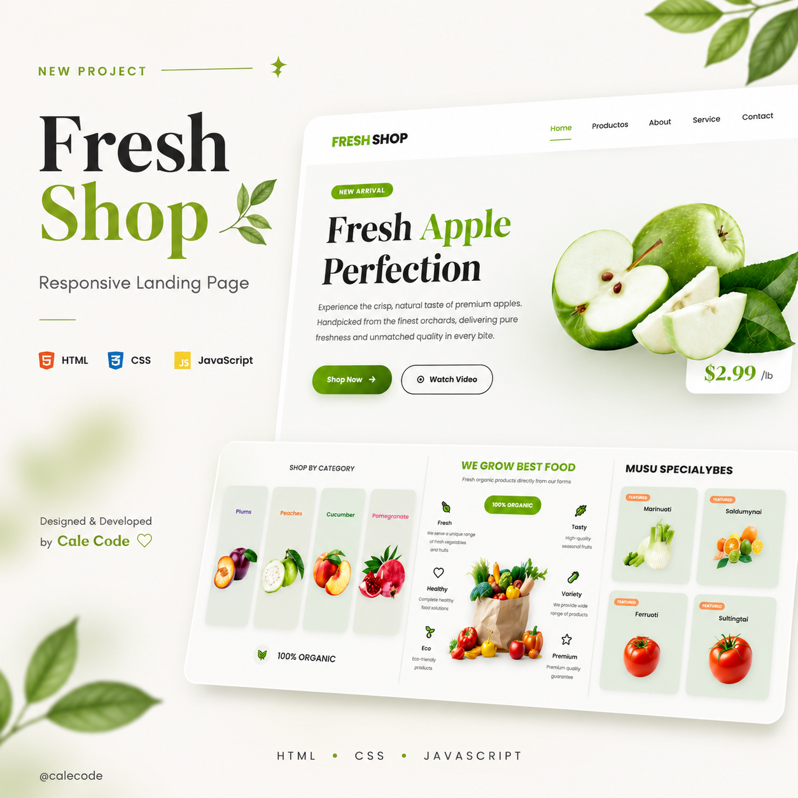

# Fresh Shop Landing Page

## Descripción

Landing Page desarrollada como proyecto de práctica para fortalecer mis habilidades en desarrollo Frontend.

En este proyecto me enfoqué en crear una interfaz moderna, visualmente atractiva y totalmente responsive, incorporando pequeñas animaciones para mejorar la experiencia del usuario y dar mayor dinamismo al sitio.

##  Demo

🔗 **GitHub Pages:** https://michellcode03.github.io/Fresh-Shop-Landing-Page/

##  Características

* Diseño responsive para dispositivos móviles, tablets y escritorio.
* Hero moderno con elementos visuales destacados.
* Animación sutil en la imagen principal del encabezado.
* Sección de productos con tarjetas personalizadas.
* Sección de beneficios y características.
* Componentes reutilizables.
* Footer moderno con newsletter y enlaces de contacto.
* Código organizado en múltiples archivos CSS y JavaScript.

## Tecnologías utilizadas

* HTML5
* CSS3
* JavaScript

## Objetivos del proyecto

Este proyecto fue desarrollado para practicar:

* Diseño de interfaces modernas.
* Responsive Design.
* Organización de estilos por módulos.
* Animaciones e interacciones con JavaScript.
* Creación de componentes reutilizables.
* Mejora de la experiencia de usuario (UI/UX).

## Mejoras futuras

* Integrar un backend para funcionalidades dinámicas.
* Optimizar el rendimiento del sitio.
* Mejorar la accesibilidad.
* Agregar más animaciones y efectos visuales.

## Vista previa

##  Autor

**Michell Code**
